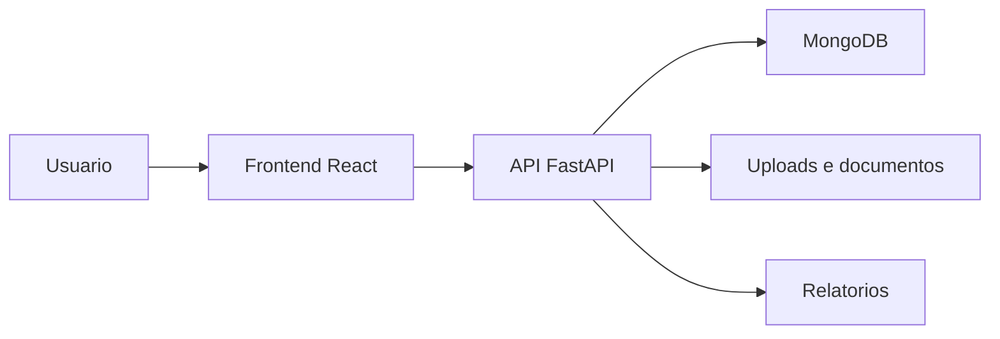

# GestaoEPI V5.0.9

Sistema web para gestao de Equipamentos de Protecao Individual (EPIs), com recursos para cadastro de colaboradores, empresas, estoque, kits, entregas, historico e relatorios.

## Visao Geral

O projeto organiza rotinas de entrega e acompanhamento de EPIs em uma aplicacao com frontend web, API backend e banco de dados. A interface permite registrar informacoes operacionais, enquanto o backend centraliza regras de autenticacao, persistencia e consultas.

## Problema Resolvido

O sistema foi desenvolvido para substituir controles manuais de EPI por um fluxo digital rastreavel, ajudando a acompanhar entregas, estoque, colaboradores, fornecedores e historico de utilizacao.

## Principais Funcionalidades

### Funcionalidades Disponiveis

- Autenticacao de usuarios.
- Cadastro de empresas e colaboradores.
- Cadastro e controle de EPIs.
- Cadastro de fornecedores.
- Organizacao de kits de EPI.
- Registro de entregas.
- Historico de entregas.
- Relatorios e documentos operacionais.
- Recursos relacionados a reconhecimento facial identificados no codigo e nas dependencias.

### Funcionalidades Em Desenvolvimento

- Alertas, kits obrigatorios e melhorias de rastreabilidade aparecem em arquivos e telas do projeto.

### Funcionalidades Planejadas

- Informacao nao confirmada no conteudo atual do repositorio.

## Como Funciona

```text
Usuario acessa o sistema
-> realiza login
-> cadastra empresas, colaboradores, EPIs e fornecedores
-> organiza kits e registra entregas
-> o backend processa as solicitacoes
-> os dados sao armazenados no MongoDB
-> relatorios e historicos ficam disponiveis para consulta
```

## Tecnologias Utilizadas

- Python
- FastAPI
- MongoDB
- React
- Tailwind CSS
- face-api.js
- html5-qrcode
- ReportLab
- OpenPyXL

## Arquitetura



## Estrutura Do Projeto

- `backend/`: API, autenticacao, banco de dados, schemas, seeds, uploads e testes.
- `frontend/`: interface web, paginas, componentes e integracao com a API.
- `tests/`: estrutura auxiliar de testes.
- `memory/` e `test_reports/`: artefatos existentes de acompanhamento do projeto.

## Status

Versao historica do GestaoEPI. Existem repositorios mais recentes relacionados, como `GestorEPI-multiempresas-v5-9` e `GestaoEPI-V5.1.0-NOVO-01`.

## Autor

Desenvolvido por Michele Santana — Kalion Tecnologia

Perfil profissional: https://github.com/Tr3mbolon4
