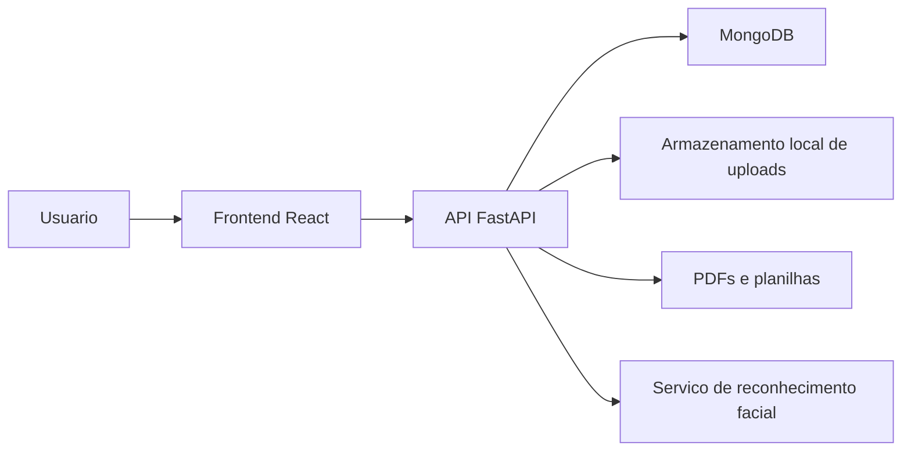

# GestaoEPI V5.0.9

Sistema web para gestao de Equipamentos de Protecao Individual (EPI), controle de estoque, entregas, colaboradores, fornecedores, kits por setor e autenticacao de fichas de entrega.

> Status: em revisao para organizacao profissional e saneamento de dados sensiveis.

## Visao Geral

O GestaoEPI V5.0.9 centraliza processos ligados ao ciclo de vida dos EPIs dentro de uma empresa: cadastro, estoque, distribuicao, devolucao, rastreabilidade, alertas e historico de entrega. A aplicacao possui backend em FastAPI, frontend em React e persistencia em MongoDB.

## Funcionalidades

- Autenticacao com perfis de acesso.
- Cadastro e gerenciamento de colaboradores.
- Controle de empresas, setores e fornecedores.
- Cadastro de EPIs, ferramentas e variacoes.
- Controle de estoque minimo e disponibilidade.
- Entrega e devolucao de EPIs.
- Kits obrigatorios por setor.
- Historico de entregas.
- Alertas operacionais.
- Geracao e verificacao de ficha de EPI.
- Suporte a validacao biometrica/facial, quando habilitada.

## Tecnologias

- Python
- FastAPI
- MongoDB
- Motor/PyMongo
- React
- Tailwind CSS
- Radix UI
- CRACO
- ReportLab
- OpenPyXL
- InsightFace

## Arquitetura



## Estrutura

```text
backend/      API, modelos, banco, autenticacao e servicos
frontend/     Interface web
docs/         Documentacao tecnica
tests/        Testes automatizados
```

## Configuracao

Copie `.env.example` para o arquivo de ambiente usado pela sua implantacao e substitua todos os valores de exemplo.

Variaveis obrigatorias:

- `MONGO_URL`
- `DB_NAME`
- `SECRET_KEY`
- `DEFAULT_ADMIN_PASSWORD`, somente no primeiro provisionamento

Nunca versione arquivos `.env`, bancos de dados, backups, fotos reais, documentos pessoais, CPFs, dados biometricos ou credenciais.

## Execucao Local

Backend:

```bash
cd backend
pip install -r requirements.txt
uvicorn server:app --reload
```

Frontend:

```bash
cd frontend
npm install
npm start
```

## Seguranca

Durante a organizacao deste repositorio foram identificados arquivos de upload versionados anteriormente. A branch de profissionalizacao remove esses arquivos do conteudo atual e atualiza o `.gitignore` para impedir novos commits acidentais.

Essa remocao nao apaga historico antigo do Git. Se os arquivos continham dados reais, ainda e necessario executar um processo separado de limpeza de historico e rotacao de credenciais, com aprovacao explicita.

Veja [SECURITY.md](SECURITY.md) e [docs/security-audit.md](docs/security-audit.md).

## Licenca

Este projeto esta marcado como proprietario ate decisao formal sobre licenciamento.

## Autor

Desenvolvido por Michele Santana / Kalion Tecnologia.

