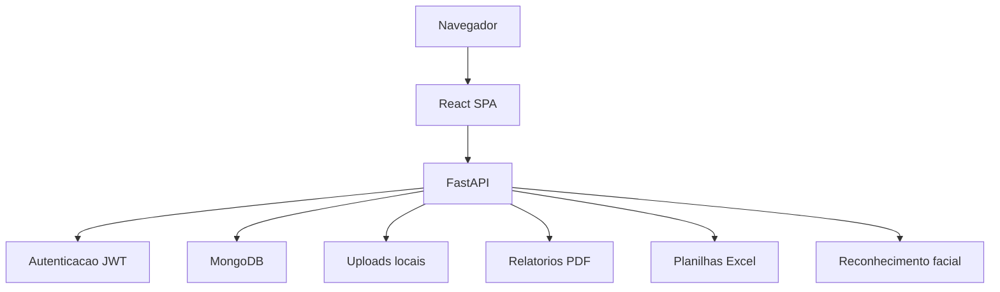

# Arquitetura do GestaoEPI V5.0.9

## Componentes

## Backend

O backend concentra regras de autenticacao, usuarios, empresas, colaboradores, EPIs, estoque, entregas, kits, alertas, fichas e integracoes auxiliares.

## Frontend

O frontend usa React e componentes de interface para entregar as telas operacionais do sistema, incluindo dashboard, colaboradores, EPIs, estoque, entregas, historico e configuracoes.

## Persistencia

O MongoDB armazena os dados operacionais. Uploads de fotos e comprovantes devem ficar fora do Git e ser tratados como dados sensiveis de ambiente.

